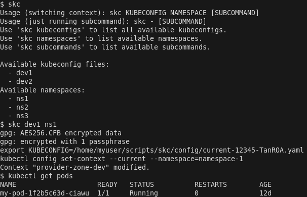
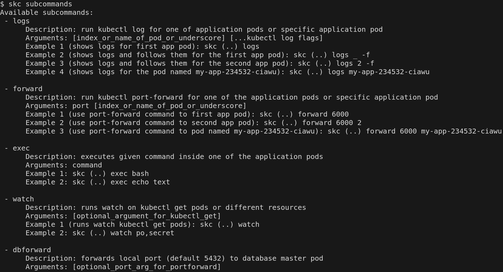
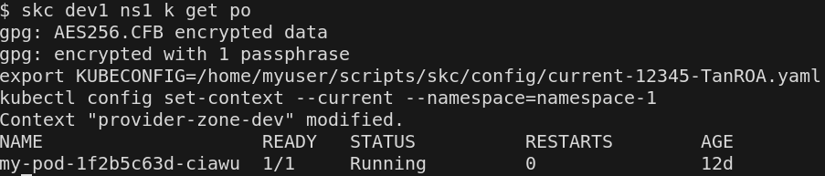

# (S)witch(K)ubernetes(C)ontext + aliases for common kubectl commands

Simple script to easily change kubeconfig and default kubernetes namespace with one command and short aliases. The script modifies environmental variables for current shell session. 

It also provides a quick way to run scripts (multiple predefined examples, but you can add your own) with aliases.
That makes work with deployments even faster and more convenient.

Unfortunately it is not possible (afaik) to pass kubeconfig file contents instead of file path. For slightly better security, kubeconfig files are **stored encrypted at rest**. The script decrypts the kubernetes config under entered alias and deletes plain text config right after ending current shell session.






> :desktop_computer: **This script requires `kubectl`, `gpg` and additional packages depending on the subcommands you intend to use.**

> :warning: **Read the code carefully. You are installing it at your own risk.**

## Installation

1. Clone repository to desired script location and enter repository directory.

2. Add alias to your shell file configuration - most likely `.bashrc` or `.zshrc` (replace `<skc_path>` with correct path). If it is not the first time installing SKC, make sure to remove old aliases. 
   ```bash
   # SKC
   alias skc="source <skc_path>/skc.sh"
   ```

   You can use one of these commands that we'll do this step for you, but make sure to use '>>' instead of '>' - otherwise you risk removing your configuration.
   ```bash
      $ printf "# SKC\nalias skc=\"source `pwd`/skc.sh\"\n" >> ~/.bashrc
      $ printf "# SKC\nalias skc=\"source `pwd`/skc.sh\"\n" >> ~/.zshrc
   ```

3. Set up your namespaces:
   - Create a directory to store the config and copy the template configuration file.
   ```bash
   $ mkdir config
   $ cp namespaces_template config/namespaces
   ```
   - Edit the file to add desired namespaces. Each line is one namespace and has a following format: \<alias>,\<namespace-name>. Remember to use ',' character. You can add new namespaces any time you want.

4. Set up your kubeconfigs for different environments and clusters:
   - Download kubeconfigs for every cluster you want.
   - For every kubeconfig choose an alias for the config (e.g. `dev-1` for kubeconfig for one of the dev clusters) and run following command (remember to replace placeholders). The command encrypts the configuration, moves it to the config directory created in the previous step and removes plain text configuration.
      ```bash
      $ gpg --output <repository directory>/config/<alias>.yaml -c --no-symkey-cache <path to downloaded file> && rm <path to downloaded file>
      ```
5. (Optional) Copy subcommands from examples and make them executable. Adjust the subcommand scripts to your environment. Replace all placeholders enclosed in angle brackets. Compatibility with other environments is not guaranteed - you can create your own subcommands according to your workflow.
      ```bash
      $ for file in `find subcommands -type f -iname '*.example'`; do cp $file subcommands/`basename -s '.example' $file`; done
      $ for file in `find subcommands -type f -not -iname '*.example'`; do chmod +x $file; done
      ```
6. (Optional) Sometimes the terminal is closing so abruptly that currently used unencrypted kubeconfig is not deleted. To make sure that unecrypted kubeconfigs are deleted, set up an additional cleanup command for unused kubeconfig files.:
   - If `crontab` is available in your OS, execute following command (in `switch-kubernetes-context` repository). This command adds a job that removes unencrypted kubeconfigs older than 3 hours and runs every 5 minutes.
      ```bash
      $ (crontab -l;echo "*/5 * * * * find \"`pwd`/config\" -type f -name 'current*.yaml' -mmin +180 -delete") | crontab -
      ```
      Alternatively, add following line to `crontab` manually (replace `<skc_repo>` with correct path).
      ```bash
      */5 * * * * find <skc_repo>/config -type f -name 'current*.yaml' -mmin +180 -delete
      ```
   - If crontab is not available (e.g. in Windows git-bash), add following line to your shell configuration file, e.g. `.bashrc` or `.zshrc` (replace `<skc_repo>` with correct path). This will remove unused kubeconfig files at the startup of the shell/terminal.
      ```bash
      # SKC cleanup
      find <skc_repo>/config -type f -name 'current*.yaml' -mmin +180 -delete;
      ```
     Alternatively, use one of the following commands (in `switch-kubernetes-context` repository) that we'll do this step for you.
      ```bash
      $ echo "find \"`pwd`/config\" -type f -name 'current*.yaml' -mmin +180 -delete" >> .bashrc
      $ echo "find \"`pwd`/config\" -type f -name 'current*.yaml' -mmin +180 -delete" >> .zshrc
      ```
7. (Optional) Set up autocompletion:
   - Create autocompletion script out of the template.
   ```bash
      $ sed "s|<skc_dir>|`pwd`|g" completions/bash_skc_completion_template > completions/skc_completion.bash
   ```
   - Add following line to the `.bashrc` to execute the script at the start of the shell session.
   ```bash
   source <skc_repo>/completions/skc_completion.bash
   ```
   - (For zsh users) It's often necessary to add these lines. It depends on your configuration.
   ```bash
   autoload -Uz compinit && compinit
   autoload -U +X bashcompinit && bashcompinit
   setopt completealiases
   ```